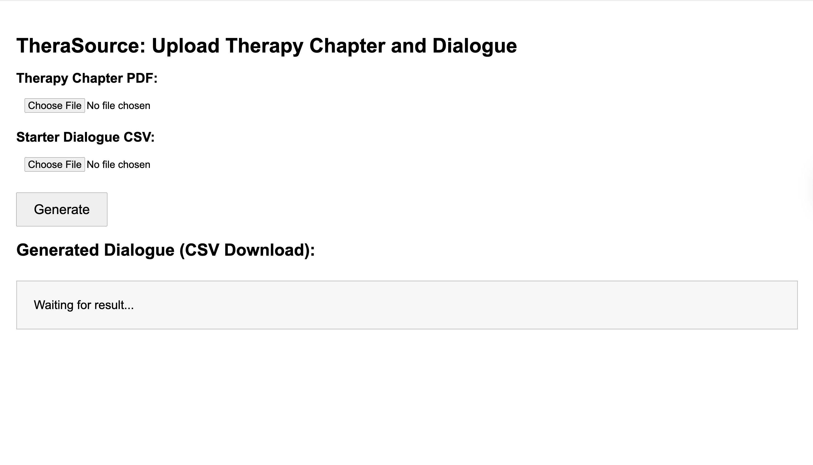
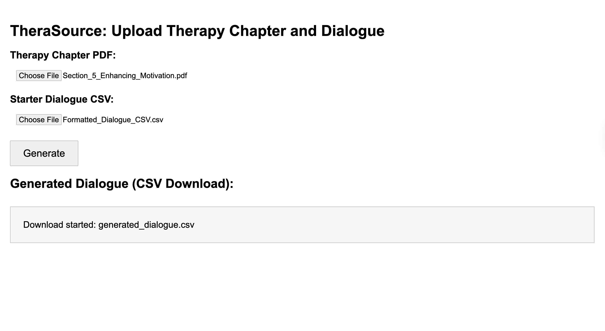
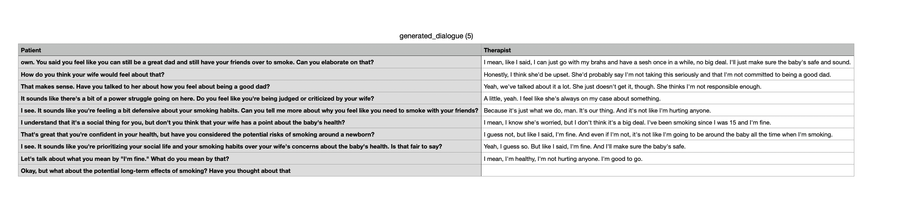

# 🧠 AI-Powered Therapy Dialogue Generator

[](https://colab.research.google.com/github/mmjsk0805/full-dialogue-generation/blob/main/llama3_server.ipynb)

A full-stack Flask web application and Google Colab-compatible notebook powered by the `meta-llama/Llama-3.1-8B-Instruct` model. This project generates full, realistic therapy dialogues based on expert-authored chapters and partial conversations.

---

## 📌 Project Overview

This tool supports mental health research and education by generating synthetic therapist–patient conversations. Given a therapy guide (PDF) and a starter dialogue (CSV), it completes the session with alternating, empathetic lines between the two roles. It’s ideal for psychologists, AI researchers, and instructors experimenting with AI in therapeutic contexts.

---

## 🚀 Getting Started

### 🔗 Run Colab Notebook as Backend

> Use this if you want to test the app quickly using free GPU on Colab.

#### Steps:

1. Open the notebook [`llama3_server.ipynb`](https://colab.research.google.com/github/mmjsk0805/full-dialogue-generation/blob/main/llama3_server.ipynb)
2. Run all cells to start the model server and expose an `ngrok` URL.
3. Copy the printed `ngrok` URL and paste it into the `LLM_ENDPOINT` variables inside:

   - `routes.py`
   - `generate.py`

   Example:

   ```python
   LLM_ENDPOINT = "https://<your-ngrok-id>.ngrok.io"
   ```

4. Then from your local terminal, run:

   ```bash
   python run.py
   ```

5. Open `http://127.0.0.1:5000` in your browser to use the app.

---

## 📁 Project Structure

```
.
├── run.py                   # Starts Flask server
├── generate.py             # Sends prompt to Colab-hosted LLaMA endpoint
├── extract_dialogue.py     # Optional CSV post-processing
├── llama3_server.ipynb     # Colab notebook interface
├── templates/
│   └── index.html          # File upload UI
├── dialogues/              # Sample input CSVs
├── outputs/                # Generated CSVs
├── models/                 # Saved models (optional)
├── screenshots/            # UI & result screenshots
├── requirements.txt
└── README.md
```

---

## 📄 About `llama3_server.ipynb`

This Colab notebook provides an interactive environment to:

- Load the LLaMA 3.1 Instruct model from Hugging Face
- Accept user-uploaded PDFs and CSVs
- Construct a prompt and generate realistic dialogue
- Expose a REST API endpoint using `flask` + `ngrok`

---

## 🧠 Prompt Design

```text
You are a professional therapist. Based on the following therapy guide and ongoing dialogue, continue the conversation empathetically and realistically.

--- Therapy Guide ---
{book_text}

--- Conversation so far ---
{starter_dialogue}

--- Continue the conversation starting as Therapist. Respond with realistic alternating lines between Patient and Therapist until a natural stopping point. ---
```

---

## 📥 Input Formats

### 🗂️ Therapy Guide (PDF)

Upload any chapter or section from a professional therapy guide.

### 💬 Starter Dialogue (CSV)

CSV with `Patient` and `Therapist` columns:

```csv
Patient,Therapist
I just feel stuck lately.,That's totally understandable. What's been going on?
```

---

## 🖼️ Screenshots

### 🧪 Step 1: Upload Interface

Shows the initial page where users upload a therapy guide and a starter dialogue.



---

### 🧪 Step 2: After Uploading Files

Once the user uploads a PDF and CSV, the generation process begins.



---

### 📤 Step 3: Generated Dialogue

Displays the downloadable dialogue output generated by the model.



---

## 📤 Output Format

Generated CSV:

```csv
Patient,Therapist
I've been anxious constantly.,Can you describe when you feel it the most?
Mostly when I wake up.,That’s a common trigger—how do your mornings start?
...
```

---

## ⚙️ CUDA vs CPU Settings

If you're using a **GPU**, make sure this is in your model call:

```python
inputs = tokenizer(prompt, return_tensors="pt").to("cuda")
```

If you're on **CPU-only environments** (like non-GPU Colab), change to:

```python
inputs = tokenizer(prompt, return_tensors="pt").to("cpu")
```

---

## 🛠️ To-Do

- [ ] Add automatic fallback from GPU to CPU
- [ ] Add front-end preview of generated dialogue
- [ ] Enable longer, multi-turn conversation generation
- [ ] Explore fine-tuning the model with stored dialogues

---

## ⚠️ Compatibility Disclaimer

This project was developed and tested on a specific machine (with a compatible GPU and environment). While every effort was made to ensure the code is portable and well-structured, **I cannot guarantee it will work perfectly on other systems without modification**.

The main goal of this repository is to **demonstrate the logic, structure, and workflow** of an AI-powered therapeutic dialogue generator. I’ve included all supporting scripts, models, and a Colab notebook to make the project as reproducible as possible.

If you encounter issues running the code on your machine, feel free to open an issue or contact me — I’d be happy to help or clarify.

---

## 📜 License

MIT License  
© 2025 [Jaden Moon](https://github.com/mmjsk0805)
